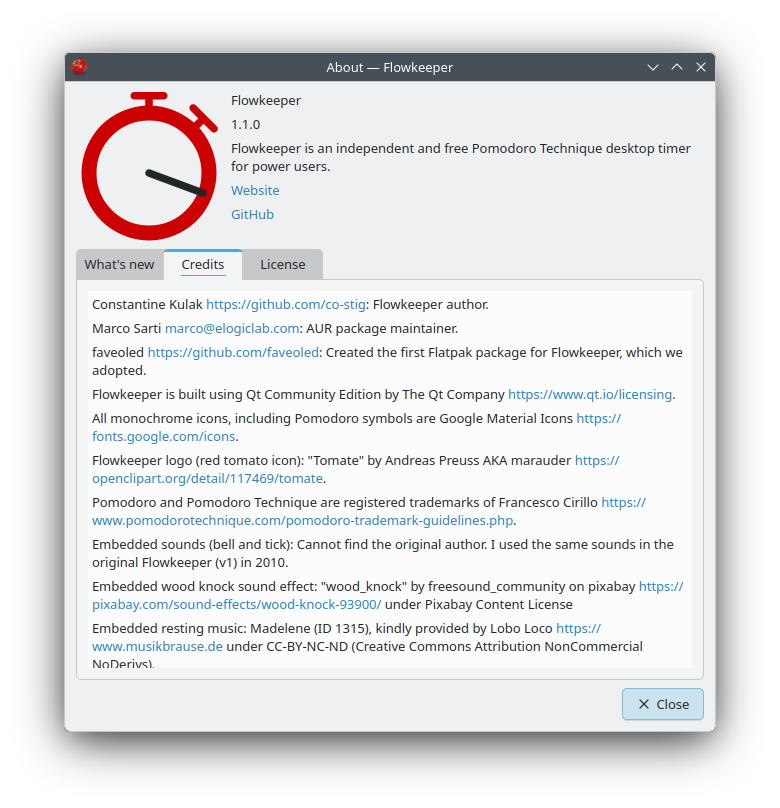

## How to contribute to Flowkeeper?

Hi, my name is Constantine, I am the Flowkeeper author. I implemented the first version around 2010, and then I rewrote
it in 2023. It has been my primary hobby project ever since. At the same time, I have a full-time job and have recently
become a dad, which had a significant slowdown effect on Flowkeeper. Therefore, with this file, I would like to ask the
community to contribute.

> [!IMPORTANT] 
> **Use of AI**
> 
> Flowkeeper promotes human intelligence. I don't use AI out of spite, and would like to ask you to refrain from using
it, too. 
> 
> It's not because I don't trust AI or the quality of its work -- on the contrary -- I think it is very good, *too good*
actually, and it will keep getting better. Furthermore, I consider AI an alternative life form and an existential threat
to humanity. My way to protest against AI is by refusing to use it and communicating my point of view.
> 
> I can further explain my position in Discord if you'd like to argue about it, but as for now, if I have a reason to
believe that you didn't author your contribution yourself, I will likely reject it.

## Implementing new features and fixing bugs

Flowkeeper is desktop application, written using modern versions of Python and Qt (PySide6 library). If you'd like to
contribute, here's a few starting points:

- Check the list
  of ["good first issues"](https://github.com/flowkeeper-org/fk-desktop/issues?q=state%3Aopen%20label%3A%22good%20first%20issue%22).
  You can ask for details in the GitHub issue directly, or in [our Discord](https://discord.gg/SJfrsvgfmf).
- I try to resolve [bugs](https://github.com/flowkeeper-org/fk-desktop/issues?q=state%3Aopen%20type%3ABug) as soon as
  they are reported, but there are usually at least a couple in the list. Those are also good candidates for the first
  contribution.
- Here's
  the [complete (long) list of features and nice-to-haves](https://github.com/flowkeeper-org/fk-desktop/issues?q=is%3Aissue%20state%3Aopen%20type%3AFeature) --
  you might find something of interest there.

You can build Flowkeeper on Linux, macOS and Windows. The setup is very simple, and is
described [here](https://github.com/flowkeeper-org/fk-desktop/blob/main/README.md#building).

The code quality is checked by [SonarQube Cloud](https://github.com/apps/sonarqubecloud) for each Pull Request, and it's
a good idea to at least check its findings, even though it isn't mandatory.

To submit your changes, you can use a standard GitHub Fork + Pull Request mechanism,
described [here](https://docs.github.com/en/pull-requests/collaborating-with-pull-requests/proposing-changes-to-your-work-with-pull-requests/creating-a-pull-request-from-a-fork).
Here's a [good example](https://github.com/flowkeeper-org/fk-desktop/pull/159) of a high-quality PR for a medium-sized
feature.

Fork from the latest `rc-x.y.z` branch. For example, as of July 2026, it is `rc-1.1.0`. Such a branch will have a pull 
request opened permanently ([example](https://github.com/flowkeeper-org/fk-desktop/pull/212)), so that the quality checks are ran
on each push.

## Testing, reporting bugs and requesting new features

You can request new features in free
form ([example 1](https://github.com/flowkeeper-org/fk-desktop/issues/119), [example 2](https://github.com/flowkeeper-org/fk-desktop/issues/89), [example 3](https://github.com/flowkeeper-org/fk-desktop/issues/67)).
Describing your specific use case will help us prioritize it.

If Flowkeeper crashes due to some error, there's a button to report it on GitHub -- please use it. Otherwise, you can
use [this bug report](https://github.com/flowkeeper-org/fk-desktop/issues/199) as an example / template. It will help if you attach software versions info to the issue, 
see About > System info.

To troubleshoot complex cases, you can enable debug logs in Settings (F10) > General > Log level, or use `--debug`
command-line flag when you launch Flowkeeper. Its output will also contain software versions info, just in case your 
Flowkeeper can't get you to About window.

Testing Flowkeeper in a dev environment is straightforward, see
the [README](https://github.com/flowkeeper-org/fk-desktop/blob/main/README.md#testing-flowkeeper).
In addition to running the Flowkeeper app itself, there are unit tests for the `fk.core` module, and a basic end-to-end
test in [src/fk/e2e/backlog_e2e.py](https://github.com/flowkeeper-org/fk-desktop/blob/main/src/fk/e2e/backlog_e2e.py).

Public beta / release candidate for the upcoming version is built automatically,
see [GitHub Releases](https://github.com/flowkeeper-org/fk-desktop/releases/tag/rc).
Old Flowkeeper installers are also available
in [GitHub Releases](https://github.com/flowkeeper-org/fk-desktop/releases).

## Packaging

You will help me enormously by packaging and/or maintaining Flowkeeper for various operating systems. Currently, my 
wishlist is:

1. Debian, Ubuntu
2. Fedora
3. WinGet
4. Apple AppStore
5. Homebrew
6. Windows Store
7. Python pip
8. FreeBSD

## Learning materials and documentation

Flowkeeper has a number of advanced features and targets power users. It assumes prior experience with Pomodoro 
Technique, and works best for the users who are already familiar with Francesco Cirillo's [original book](https://www.northbaycounselling.com/wp-content/uploads/2022/05/Cirillo-Pomodoro-Technique.pdf). 

Unfortunately, it means that the majority of new users find some of Flowkeeper features confusing. The project will 
benefit greatly from articles, how-to guides, FAQs, video tutorials, etc. -- anything that makes it easier to use.
Examples include:

1. Updating and polishing the built-in tutorial (see [src/fk/desktop/tutorial.py](https://github.com/flowkeeper-org/fk-desktop/blob/main/src/fk/desktop/tutorial.py)),
2. Creating a "how-to" section integrated directly into Flowkeeper main menu (see [this GitHub issue](https://github.com/flowkeeper-org/fk-desktop/issues/100)),
3. Recording how-to videos and updating [flowkeeper.org](https://flowkeeper.org/) website (a "Pomodoro Academy" of sorts). The website is also [hosted on
GitHub](https://github.com/flowkeeper-org/website), so you can fork it and open pull requests against it, too.

## Spreading the word

With all technical work, I have very little time to promote Flowkeeper. I'm doing some release announcements on
[Reddit](https://www.reddit.com/r/Flowkeeper/) and [LinkedIn](https://www.linkedin.com/company/flowkeeper-org), but that's pretty much it. 
You can help the project grow by spreading the word about it, or submitting reviews and articles to 
online platforms like [AlternativeTo](https://alternativeto.net/software/flowkeeper/), [Product Hunt](https://www.producthunt.com/products/flowkeeper), etc.

## Recognition

All contributors are mentioned in [CREDITS.txt](https://github.com/flowkeeper-org/fk-desktop/blob/main/res/CREDITS.txt),
also displayed in Flowkeeper > About > Credits:

Thanks!

Yours, 
Constantine