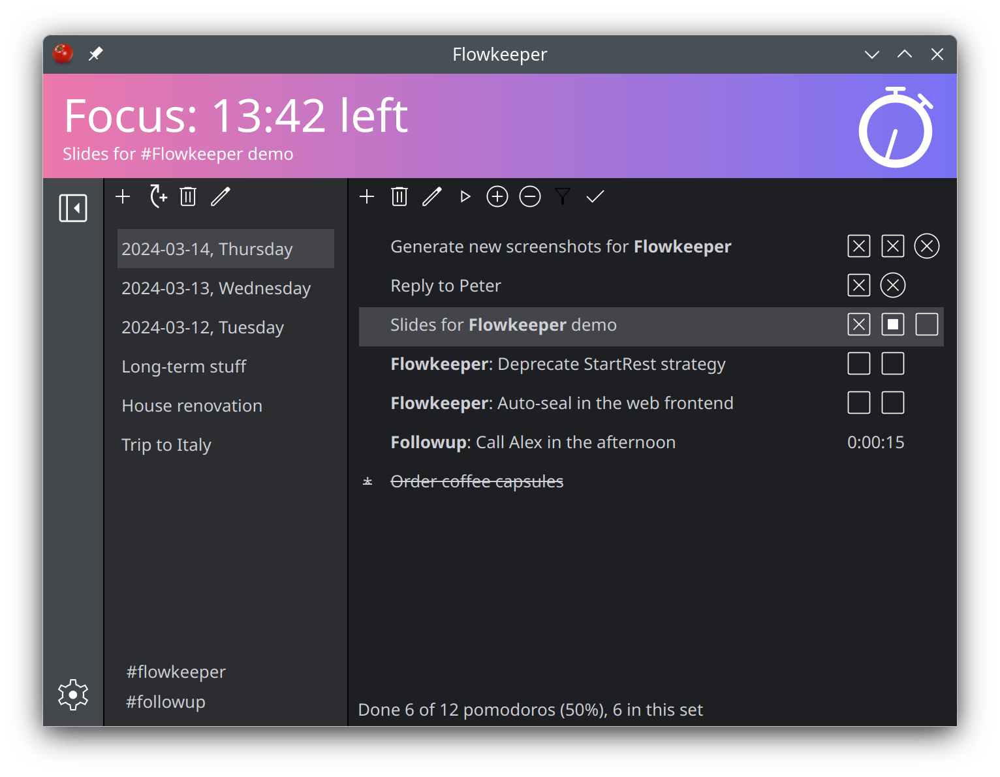

# Flowkeeper


[](https://coveralls.io/github/flowkeeper-org/fk-desktop?branch=main)
[](https://sonarcloud.io/summary/new_code?id=flowkeeper-org_fk-desktop)

Flowkeeper is an independent Pomodoro Technique desktop timer for power users. It is a 
simple tool, which focuses on doing one thing well. It is Free Software with open source. 

Visit [flowkeeper.org](https://flowkeeper.org) for screenshots, downloads and FAQ.



## Building

Flowkeeper has a single major dependency -- Qt 6.6, which in turn requires Python 3.8 or later (3.9+ if you
use Qt 6.7). To create installers and binary packages we build Flowkeeper on Ubuntu 22.04 using Python 3.11 
and the latest version of Qt (6.7.2 at the time of writing). We also occasionally test it on Ubuntu 20.04 
against Qt 6.2.4 and Python 3.8.10. Some features might not work as expected with Qt 6.2.x.

OLD ADVICE, which might not be relevant to you anymore: If you want to build it with Ubuntu 20.04 or Debian 11, 
both of which come with older versions of Python, you would have to 
[compile Python 3.11](https://fostips.com/install-python-3-10-debian-11/). <-- Try the system Python version 
first. 

### Building for Linux and macOS

Create a virtual environment and install dependencies:

```shell
python3 -m venv venv
source venv/bin/activate
pip install -r requirements.txt
```

Note that `requirements.txt` contains ALL libraries and tools needed to run, test and
create installers. You can use `requirements-run.txt` if you only want to debug
Flowkeeper locally, or `requirements-build.txt` if you also want to create distributable /
portable bundles.

Then you need to "generate resources", which means converting data files in `/res` directory into
the corresponding Python classes. Whenever you make changes to files in `/res` directory, you need
to rerun this command, too:

```shell
./generate-resource.sh
```

From here you can start coding. If you want to build an installer, refer to the CI/CD pipeline in
`.github/workflows/build.yml`. For example, if you want to build a DEB file, you'd need to execute 
`pyinstaller installer/normal-build.spec` and then `./package-deb.sh`. 

### Building for Windows

Consult the above section for details. In short, install Python 3.11. Then:

```shell
python3 -m venv venv
source venv/bin/activate
pip install -r requirements.txt
```

Generate resources:

```shell
cd res
pyside6-rcc --project -o resources.qrc
pyside6-rcc -g python resources.qrc -o "../src/fk/desktop/resources.py"
```

Package as a distributable / portable bundle (OPTIONAL):

```shell
pyinstaller installer\portable-build.spec
pyinstaller installer\normal-build.spec
```

## Testing Flowkeeper

To execute Flowkeeper:

```shell
PYTHONPATH=src python -m fk.desktop.desktop
```

To run unit tests w/test coverage (install requirements from 
`requirements.txt` or `requirements-test.txt` first):

```shell
PYTHONPATH=src python -m coverage run -m unittest discover -v fk.tests
python -m coverage html
```

To execute end-to-end tests:

```shell
PYTHONPATH=src python -m fk.desktop.desktop --e2e
```

## Technical details

- [Design considerations](doc/design.md)
- [Data model](doc/data-model.md)
- [Strategies](doc/strategies.md)
- [Events](doc/events.md)
- [UI actions](doc/actions.md)
- [CI/CD pipeline](doc/pipeline.md)
- [Building for Alpine Linux](doc/build-alpine.md)

## Copyright

Copyright (c) 2023 - 2024 Constantine Kulak.

This program is free software: you can redistribute it and/or modify
it under the terms of the GNU General Public License as published by
the Free Software Foundation; either version 3 of the License, or
(at your option) any later version.

This program is distributed in the hope that it will be useful,
but WITHOUT ANY WARRANTY; without even the implied warranty of
MERCHANTABILITY or FITNESS FOR A PARTICULAR PURPOSE.  See the
GNU General Public License for more details.

You should have received a copy of the GNU General Public License
along with this program.  If not, see <https://www.gnu.org/licenses/>.
